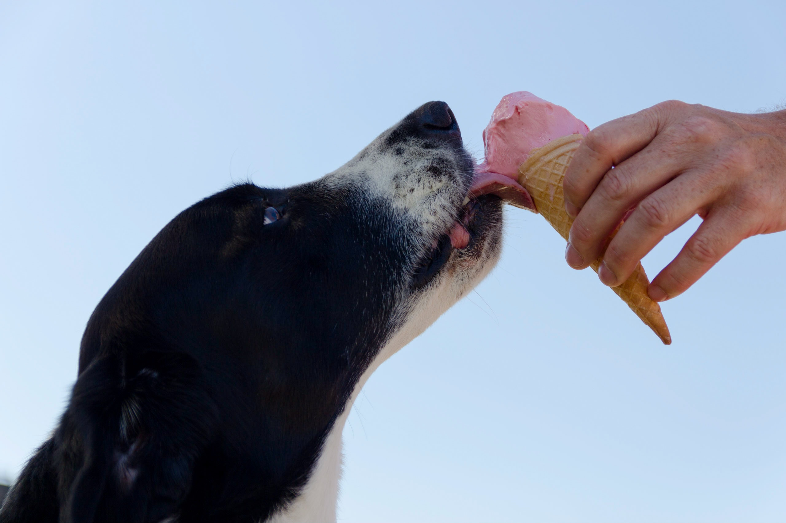

# Sinatra Project: Fresh Bites

Fresh Bites is a demo web application created using Sinatra that allows users to create an account to view and create recipes for their furry friends.

 

## Installation

* Install Ruby 2.6.1 on your local computer
* Fork the repository from https://github.com/mvlt18/sinatra-project
* Clone the repository into a directory of your choice with `git clone git@github.com:mvlt18/sinatra-project.git`
* Navigate to the directory with `cd sinatra-project`
* Run `bundle install`
* Create the program tables `rake db:migrate`
* Run `shotgun`
* Open a browser of your choice (we recommend Chrome) and enter the given local url provided by the shotgun server.

## Demo

<Insert Demo>

## Contributing

You can make a request or report a bug by creating an issue or by submitting a pull request.
* Create a branch named after the feature or bug.
* Write your code and commit changes/issue with a commit message.
* Push the branch to the master branch.
* Create a pull request, explaining the issue/reason for change/feature addition.

## License
